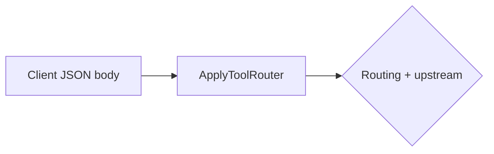

# Version 0.1.1 — implementation plan (agent brief)

**Product:** Claudia Gateway — OpenAI-compatible LLM gateway with **BiFrost** upstream.

**Audience:** Implementing agents should treat this doc as the **source of truth** for *what* v0.1.1 delivers, *constraints*, *order of work*, and *how to verify*.

**Implementation snapshot:** **G1** and **G6** are **Done**. **G5** is **Partial** (quota admission + metrics UI + **virtual-model 413 fallback** **shipped**; **413 cooldown timers** not). **G2–G4** (tool slimming, router config + admin, transformer pipeline) are **Done** in code: `internal/transform` tool-router, `routing.router_models` + `routing.tool_router` in **`gateway.yaml`**, admin panel **Router models (tool slimming)**, and **`POST /v1/chat/completions`** wiring in **`internal/server/server.go`**. Details in the goals table, §3.3, §3.1 / §3.5 (transformer design), §3.6–3.7, and §4–§7.

---

## 1. Goals (what v0.1.1 implements)


| #   | Status   | Goal                                             | User-visible outcome                                                                                                                                                                                                                                                                                                                                 |
| --- | -------- | ------------------------------------------------ | ---------------------------------------------------------------------------------------------------------------------------------------------------------------------------------------------------------------------------------------------------------------------------------------------------------------------------------------------------- |
| G1  | **Done** | **Local (Ollama) models in free-tier filtering** | When free-tier filtering is on, **Ollama** models from the live catalog can appear in merged model listing and in **generated** routing/fallback (same intersection rules as other providers).                                                                                                                                                       |
| G2  | **Done** | **Smaller upstream `tools` payloads**            | When the tool-router is enabled and **`tools`** is present, the gateway **replaces** `tools` with the subset whose router-assigned **confidence ≥ threshold** before normal routing/upstream (fail-open keeps all tools on any router error).                                                                                                                                                                       |
| G3  | **Done** | **Configurable router model + admin visibility** | Operators set ordered **`routing.router_models`** and **`routing.tool_router`** in **`gateway.yaml`**; admin **Routing & fallback** shows the list, threshold, enable flag, **last router call** (model, time, error), and **catalog-missing** ids after save.                                                                                                                                                      |
| G4  | **Done** | **Transformer pipeline on chat completions**     | **`POST /v1/chat/completions`** runs the **tool-router transformer** first (see §3.5.1), then the existing virtual-model / direct proxy path unchanged.                                                                                                                                                                                            |
| G5  | **Partial** | **413-aware behavior with cooldowns**            | **Shipped:** **Quota admission** (same as before). **Virtual Claudia:** on upstream **HTTP 413**, the gateway **records metrics** for that attempt then walks **`routing.fallback_chain`** from the policy-aligned start, **skipping any model id that already returned 413** on the same request, and retries the **same** client payload on the next candidate (same behavior class as 429/5xx fallback). **Direct** upstream id: **413** is returned to the client (**no** fallback). **Not shipped:** time-based **413 cooldown** / backoff config, TPM vs payload classification (§3.3). |
| G6  | **Done** | **Observability path**                           | The gateway **records** metrics for upstream outcomes because **Go plugins are not portable** on **Windows**. Persistence is **SQLite** under **`data/gateway/`** (§3.6); **`make clean-data`** removes it. Operators can inspect rollups and recent events via **admin** **`/ui/metrics`** (JSON **`/api/ui/metrics`**) and the desktop shell **Stats** tab. **`config/provider-model-limits.yaml`** (§3.7) is **loaded** and **wired into chat** for pre-flight quota checks (see G5 **Partial**). |


**Operator verification (G1)** — Claudia **desktop** → **admin** → generate routing/fallback: chain included **Ollama** models as expected under free-tier patterns.

**Implementation check (G2–G4)** — **Done.** `handleV1Chat` calls **`transform.ApplyToolRouter`** (after JSON decode, before routing) so **`tools`** may be slimmed. Package **`internal/transform`** implements the contract in §3.1 / §3.5.1. Config: **`routing.router_models`**, **`routing.tool_router.enabled`**, **`routing.tool_router.confidence_threshold`** (see **`config/gateway.example.yaml`**). Admin: **`internal/server/embedui/panel.html`** section **Router models (tool slimming)** + **`POST /api/ui/routing/router_tooling`**. Per-request overrides: headers **`X-Claudia-Tool-Router: skip`** and **`X-Claudia-Tool-Confidence-Threshold`** (see panel copy).

**Implementation check (G6)** — **Done** (baseline + operator UI): **`internal/gatewaymetrics`** opens **`data/gateway/metrics.sqlite`** (paths from **`metrics.*`** in **`gateway.yaml`** — **`docs/configuration.md`**). **`migrations/gateway/*.sql`** apply **only at process start** (§3.6.2). **`internal/chat`** records **one event per upstream HTTP outcome** (provider prefix, full model id, status, **tiktoken `cl100k_base`** estimate of the **proxied JSON body**). Tables: **`upstream_call_events`**, **`upstream_rollup_minute`** / **`upstream_rollup_day`** (UTC minute / UTC day per status). **`internal/gatewaymetrics/query.go`** exposes rollups + recent events for **`internal/server/ui_metrics.go`** (**`GET /api/ui/metrics`**, session-auth) and **`internal/server/embedui/metrics.html`**; the desktop **`shell.html`** includes a **Stats** tab (`/ui/metrics?embed=1`). Failed open → **no** metrics; **`Runtime.LimitsGuard()`** is **nil** without a store, so **quota YAML does not enforce** until metrics work. **413 cooldown** logic still **not** implemented (separate from quota admission).

**Explicitly out of scope for v0.1.1**

- **Message deduplication** (e.g. duplicate file bodies in context): error-prone; defer (possible future summarizer).
- **RAG transformer behavior beyond a stub** — any real vector/RAG work is **v0.2+**; v0.1.1 may reserve hooks only.

---

## 2. Dependencies and sequencing (what must happen first)

1. **Gateway metrics (G6) for G5** — **G6 is shipped** (SQLite + migrations + chat recording + operator metrics UI per §3.6 and **Implementation check (G6)** above). **Quota admission** ( **`provider-model-limits.yaml`** + **`LimitsGuard()`** + chat pre-flight, §3.7.6) **consumes** the same store via **`upstream_call_events`** windows — **not** a BiFrost **Go plugin**. Remaining **G5** work: **413**-driven **cooldown** / backoff config and classification (§3.3), **not** yet tied to metrics reads.
  - **Ollama patterns (G1)** — **done**; **tool slimming (G2)**, **router config + UI (G3)**, **transformer + tool router (G4)** — **done** in gateway (§3.5.1).
  - **413 handling:** **Virtual** path: **fallback after 413** + per-request **exclude-413-models** — **shipped** in **`internal/chat`**. **Direct** 413: **no** fallback (unchanged). **Cooldown** timers / cross-request 413 memory still **open**.
2. **Router model available in config** — Tool slimming **requires** a working router model id and a call path (same BiFrost base + key as chat, per decision).
3. **Continue / client** — Tool slimming assumes tools arrive in the JSON **`tools`** array with **unique `function.name`** fields. Per-request **threshold override** is the header **`X-Claudia-Tool-Confidence-Threshold`**; **`X-Claudia-Tool-Router: skip`** disables slimming for one call.

---

## 3. Technical contracts (implement exactly)

### 3.1 Tool slimming (router output)

- **Input to router:** User prompt + context as needed (and optionally merged tool list vs MCP later); **source of truth** for definitions is the request `**tools`** array.
- **Router output (JSON):** array of `{ "name": "<string>", "confidence": <number> }` where `name` matches a tool in the incoming list.
- **Selection:** Keep tools where `confidence >= threshold`.
- **Threshold:** Default **`routing.tool_router.confidence_threshold`** in **`gateway.yaml`** (default **0.5**); **optional per-request override** via **`X-Claudia-Tool-Confidence-Threshold`** (0–1).
- **Failure** (timeout, non-200, invalid JSON, missing names): **do not slim** — pass **all** client `tools` upstream.
- **No** extra chat messages and **no** new routing-policy rules for this step — only mutate `**tools`** on the outbound body.

### 3.2 Ollama + free tier

- Use `**patterns:**` in `config/provider-free-tier.yaml` with existing `**path.Match**` semantics (`internal/providerfreetier/spec.go`). Example: `ollama/*` under `patterns:` (one segment after `ollama/` per `*`; add more patterns if ids are deeper).
- **Policy:** **allow-all-local** — any Ollama model returned by the upstream catalog that matches the pattern is eligible; **no** extra security/ops gate in v0.1.1 beyond normal config hygiene.
- **Ship:** default or documented pattern + short note in operator docs so generate-routing and `GET /v1/models` behave as expected.

### 3.3 413 behavior

- **Virtual Claudia** (policy + **`routing.fallback_chain`**): on upstream **HTTP 413** (`Request Entity Too Large`), the gateway **records** the outcome in **gateway metrics** (status **413** for that model id), then continues along the **same** fallback chain order as for 429/5xx, using the **unchanged** client JSON body. Any model id that **already returned 413** on that request is **not** invoked again (so duplicate ids in the chain are skipped without a second upstream call). **Not yet implemented:** configurable **cooldown timers**, **last-success vs last-request** clock mode, and **longer backoff** after repeated 413 on a model across requests (tracked for a later iteration).
- **Direct** request with a **concrete** upstream model id: **413 is expected** for that model — **do not** fall back or change model; return the error to the client.
- **Classification:** Prefer parsing response body where needed to distinguish **TPM/quota 413** vs **payload-too-large** semantics (TBD per provider).

### 3.4 Router model config

- **`routing.router_models: []`** in **`gateway.yaml`**: **ordered** upstream model ids. The gateway tries **each entry in order** for the scoring call until one returns valid JSON scores; if **all** fail, the client **`tools`** list is left unchanged (fail-open).
- **`routing.tool_router.enabled`** (bool): when **`true`** and **`router_models`** is non-empty, the tool-router transformer runs on **`POST /v1/chat/completions`**. When **`router_models`** is empty, the transformer does not run regardless of this flag. If **`enabled`** is omitted and **`router_models`** is non-empty, the effective default is **enabled**.
- **`routing.tool_router.confidence_threshold`**: **0–1**; tools with **confidence ≥ threshold** are kept.
- **Invocation:** same BiFrost **base URL** and **Bearer API key** as normal chat proxy (`POST /v1/chat/completions` on the router model, **non-streaming**).
- **Admin panel:** list, threshold, enable flag, in-process **last router attempt** (model, RFC3339 time, error string), and **ids not found** in upstream **`GET /v1/models`** after save.
- **Routing preview / generate:** the same admin flow that builds **`routing-policy.yaml`** and **`routing.fallback_chain`** also recomputes **`routing.router_models`** (up to **8** ids) via **`routinggen.OrderRouterModels`**: prefer **smaller/faster** models (inverse of fallback “strength” heuristics), add **RPM** and **TPM** bonuses from **`config/provider-model-limits.yaml`** when loaded, and rank **hosted** slightly above **`ollama/`** at equal score. **`tool_router.enabled`** / **`confidence_threshold`** are **not** changed by generate (only the model list is patched).
- **Skip one request:** client header **`X-Claudia-Tool-Router: skip`** disables slimming for that call only.

### 3.5 Transformers

- **Pipeline:** runs on **`POST /v1/chat/completions`** before routing/upstream proxying. v0.1.1 ships **one** transformer (**tool slimming**); order is fixed as **[tool-router] → (existing routing + upstream)**. **Parallel** execution remains a future option for independent transformers (e.g. tool slimming + RAG).
- **Tool slimming transformer:** implements §3.1; code in **`internal/transform`** (`ApplyToolRouter`).
- **RAG transformer:** **stub only** until v0.2 (no real Qdrant/query behavior required for v0.1.1 ship).
- **MCP mock:** clarify in implementation — **tests** at minimum; optional **dev flag** if useful.

#### 3.5.1 Transformer design: tool-router (evaluation)

**Placement in the request path**

1. Gateway validates the gateway **Bearer** token and parses the JSON body into a generic **`map[string]json.RawMessage`** (same as today).
2. **Transformer stage:** if tool-router is **effective** (see §3.4), **`ApplyToolRouter`** may replace **`tools`** on that map; otherwise the map is unchanged.
3. **Routing stage:** unchanged — virtual **`Claudia-<semver>`** uses routing policy + fallback chain; **direct** model id skips policy pick but still receives the **post-transform** body.



**Effective tool-router** means: **`routing.tool_router.enabled`** is true, **`routing.router_models`** is non-empty, the request is not opted out with **`X-Claudia-Tool-Router: skip`**, and the body contains a non-empty **`tools`** JSON array of **`type: function`** tools each with a **`function.name`**.

**Router call (internal)**

The transformer builds a **new** chat-completions request (not visible to the original client):

| Message role | Content |
| -------------- | -------- |
| **system** | Instructs the model to act as a **tool-router**: given the **full `tools` JSON** and the **user’s most recent user-role message**, output **only JSON** scoring **each** tool **`name`** with **`confidence`** in **[0, 1]** — how likely the **upstream** model will **need** that tool **on this turn**. Allowed shapes: a JSON **array** `[{"name":"…","confidence":…}, …]` or an object **`{"tools":[…]}`**. |
| **user** | Concatenates a short label, the **stringified `tools` array** from the client body, and the **extracted user text** (last **`role: user`** message in **`messages`**; if **`content`** is not a plain string, a compact JSON/text representation is used). |

The gateway POSTs that payload to **`{upstream.base_url}/v1/chat/completions`** with **`stream: false`**, **`temperature: 0`**, and **`model`** set to each **`router_models`** entry **in order** until a response yields parseable scores.

**Parsing and selection**

- The assistant **`message.content`** is trimmed; optional **``` / ```json** fences are stripped, then JSON is parsed as either the **array** form or the **`{tools:[…]}`** wrapper.
- For each original tool, **`confidence`** is read by **`function.name`**. If a **name** is **missing** from the router output, that tool is **kept** (conservative default).
- **Threshold:** keep tools with **`confidence ≥ threshold`** (threshold from config, optionally overridden per request via **`X-Claudia-Tool-Confidence-Threshold`**).
- If **no** tool would remain (all below threshold), the gateway **does not slim** — it passes **all** tools upstream (same fail-open spirit as a bad router response).
- **Failure** (transport error, non-2xx, invalid JSON, empty scores, or all router models exhausted): **do not slim** — pass **all** client **`tools`**.

**Side effects and metrics**

- Router calls are **not** mixed into **`LimitsGuard`** admission or **gateway metrics** SQLite counts in v0.1.1 (only the main proxied completion is metered as today). The admin UI records **last attempt** (model, UTC time, short error) **in memory** for the running process.
- Router HTTP timeout is capped (implementation: **min 5s, max 60s**, derived from **`health.chat_timeout_ms`**).

### 3.6 Gateway metrics (SQLite, migrations, aggregates)

**Purpose:** Persist enough **upstream-facing** signal for **G5** (413 / TPM cooldown) and operator visibility, without relying on BiFrost Go plugins.

#### 3.6.1 On-disk layout

- **Directory:** `data/gateway/` (same **`data/`** convention as `data/bifrost/`, `data/qdrant/`).
- **Database file:** e.g. `data/gateway/metrics.sqlite` (exact filename is an implementation detail; keep a single primary DB file in that directory unless split is justified later).
- **`make clean-data`** (with `CONFIRM=1`) **must** remove `data/gateway/` alongside BiFrost and Qdrant data so operators get a consistent “empty local stack” story.

#### 3.6.2 Migrations (file-based, not DDL in Go)

- **Authoring rule:** Schema changes live in **committed SQL migration files** under a **standard, top-level directory** (e.g. `migrations/gateway/`). **Do not** define migrations as string literals or ad-hoc `Exec` of DDL scattered in application code — only a small **runner** in Go (open DB, apply pending files in order, record version).
- **Acceptable:** The runner may use `//go:embed` **only** to bundle those same committed `.sql` files for single-binary convenience, as long as the **source of truth** remains the filesystem paths in the repo (reviewable diffs, no hand-written DDL in `.go`).
- **Startup behavior:** On gateway **process start**, before accepting traffic that depends on metrics: if the DB file is **missing**, **create** it and apply **all** migrations through **latest**. If the DB exists, run **only pending** migrations through **latest**.
- **No hot migration:** While the process is **live**, **do not** poll the filesystem for new migration files, **do not** re-run the migrator on a timer, and **do not** treat “DB deleted / tables missing / schema behind” as a signal to auto-heal in place. If the file disappears or is corrupted at runtime, **log clearly** and **disable or degrade** metrics recording for that process lifetime (or exit, if the product prefers fail-hard — pick one behavior in implementation and test it). **Operator fix:** restart after restoring or wiping `data/gateway/`; migration runs again on **next** startup. (This matches common embedded-SQLite practice and avoids surprising mid-flight schema locks.)

#### 3.6.3 What to record (upstream contract)

For each relevant **upstream** round-trip (at minimum the BiFrost proxy path used for chat completions; extend if other routes should count):

| Dimension | Requirement |
| --------- | ----------- |
| **Model** | Resolved upstream model id (same string used for routing / catalog alignment). |
| **Provider** | Provider key or stable provider id used by the gateway (consistent with config and logs). |
| **Estimated token count** | Best-effort estimate for the **request** (and optionally **response** if cheap — document which is stored); used for TPM-style reasoning. Exact estimator is implementation-defined but must be **documented** (e.g. heuristic vs tokenizer). |
| **Response from upstream** | For metrics, treat this as the **HTTP result**: **status code** (200, 400, 413, 500, 503, 504, …). **Do not** persist full response bodies by default (size, privacy). Optional tiny **error snippet** for ops is **out of scope** for v0.1.1 unless required for **G5** classification. |

#### 3.6.4 Rollups and reporting (model + provider)

The store must support **counts keyed by (model, provider)** for the **current calendar minute** and **current calendar day**:

- **Calls** — count of upstream attempts (define whether retries increment once vs per attempt; document; prefer **per upstream HTTP response** for G5 alignment).
- **Estimated tokens** — sum of stored estimates for the same windows (same definition as §3.6.3).
- **Response codes** — counts **per status code** within the same **minute** and **day** buckets (e.g. how many 200 vs 413 vs 503 in the current minute and current day).

**Time bucketing:** Use explicit **UTC** for **calendar minute** buckets (RPM/TPM alignment) unless the implementation documents a sliding minute window. **Calendar day** for **generic** metrics rollups may remain UTC for simplicity; for **RPD/TPD enforcement** vs configured caps, **day bucket keys must follow §3.7** (`usage_day_timezone` per provider — e.g. UTC for Groq, `America/Los_Angeles` for Pacific-reset vendors). “Current minute” in UI means the UTC minute bucket containing “now” unless documented otherwise. Keep **minute** vs **vendor-local day** semantics explicit in code and tests.

**Implementation shape:** Either **append-only events** plus indexed queries / materialized rollups, or **mutable counter rows** per `(provider, model, bucket, status)` updated on each response — choose for simplicity and testability; tests must assert correct bucket boundaries and status breakdowns.

### 3.7 Provider / model limits (`config/provider-model-limits.yaml`)

**Purpose:** Declare **vendor quota ceilings** (RPM, RPD, TPM, TPD) and **when a provider’s day resets** for day-scoped limits. This file feeds **admission / guards** (separate from **`config/routing-policy.yaml`**, which expresses request-shape **preferences**). Limits are **not** returned by BiFrost; operators maintain them (or ship defaults / generated snapshots).

#### 3.7.1 File and wiring

- **Path:** `config/provider-model-limits.yaml` (committed or operator-maintained; optional `config/provider-model-limits.example.yaml` in repo for documentation parity with other config).
- **Gateway:** Load path from **`paths.provider_model_limits`** in **`gateway.yaml`** (default **`./provider-model-limits.yaml`** next to the gateway config file). **Validate** limits YAML on load (**unknown fields rejected**; invalid file → empty spec + log, process continues).

#### 3.7.2 Merge semantics (more specific wins)

Limits are resolved for each upstream id **`provider/model`** (same string family as routing and metrics).

1. **Global defaults** — optional top-level block (e.g. `defaults:`) with any of `rpm`, `rpd`, `tpm`, `tpd`. Omitted or `null` means **no limit** for that dimension at that layer (until a more specific layer sets a value).
2. **Provider** — under e.g. `providers.<provider_key>:` set limits and **day reset** (see §3.7.3). Provider values **override** global defaults for each field present (non-null).
3. **Provider + model** — under e.g. `providers.<provider_key>.models["provider/model"]:` (or equivalent map keying full model id). Per-model values **override** provider (and global) for each field present.

**Rule:** For each numeric limit field, **the most specific non-null value wins** (`model` > `provider` > `global`). If all are absent/null for a dimension, **do not enforce** that dimension for that model.

#### 3.7.3 Provider day reset (timezone)

- Each **provider** entry **must** be able to declare how **calendar day** is defined for **RPD** and **TPD** (vendors differ: e.g. Groq **UTC**, Gemini **Pacific**).
- Express as an **IANA timezone name** (recommended), e.g. `usage_day_timezone: UTC` or `usage_day_timezone: America/Los_Angeles`. Use IANA so **DST** is handled consistently when computing “today’s” local date for bucketing.
- **Inheritance:** If only global defaults exist, define a **default** `usage_day_timezone` at global level or require every `providers.*` block to set it — pick one and validate (fail startup if a provider with RPD/TPD set lacks a timezone).

#### 3.7.4 Example shape (illustrative; exact field names may match implementation)

```yaml
schema_version: 1

defaults:
  rpm: null
  rpd: null
  tpm: null
  tpd: null

providers:
  groq:
    usage_day_timezone: UTC
    rpm: 30
    rpd: 14400
    tpm: 6000
    tpd: null
    models:
      groq/llama-3.3-70b-versatile:
        tpm: 12000
  google:
    usage_day_timezone: America/Los_Angeles
    rpm: null
    rpd: null
    tpm: null
    tpd: null
    models: {}
```

#### 3.7.5 Interaction with metrics (G6) and guards

- **Usage** (SQLite rollups / events) is compared to **effective limits** from this file when deciding skip / reorder / cooldown.
- **Same estimator** for TPM/TPD as documented in §3.6.3 unless explicitly documented otherwise.

#### 3.7.6 Implementation check (G5 – limits + chat admission) — **Done (quota path); 413 cooldown open**

The loader, resolver, admission primitives, and **chat-path wiring** are shipped: **`internal/chat`** calls **`Runtime.LimitsGuard()`** before each upstream attempt (virtual fallback and direct model). Denied candidates are **skipped** in the fallback loop; the last candidate denied by quotas returns **HTTP 429** with **`type: gateway_provider_limits`**. Direct requests return the same **429** shape when the sole model would exceed limits. **413 cooldown** (§3.5) remains a separate follow-up.

- **Package `internal/providerlimits`:**
  - `Parse` / `Load` / `LoadOrEmpty` read `provider-model-limits.yaml` with **unknown fields rejected** (`yaml.KnownFields(true)`). An empty or missing file yields an empty `Config` (no enforcement). Invalid files fail startup loading; a bad file logged by the gateway falls back to an empty spec so the process still runs.
  - **Merge semantics match §3.7.2:** `Config.Resolve(upstreamID)` layers `defaults` → `providers.<p>` → `providers.<p>.models.<p/m>`; the most specific **non-nil** value wins per dimension. Model keys **must** start with `"<provider>/"`; mismatched prefixes are rejected.
  - **Day reset (§3.7.3):** `usage_day_timezone` is an IANA name validated via `time.LoadLocation`. A provider that sets `rpd`/`tpd` (or any of its models does) must resolve a tz from its own block or `defaults`; startup fails otherwise.
  - **Time math:** `MinuteKey` returns UTC minute keys (RPM/TPM are UTC-aligned in the metrics schema). `DayKey(at, tz)` returns the calendar-day string for an instant in `tz`. `DayWindow(at, tz)` returns the `[startUTC, endUTC)` bounds of the local day (DST-safe — tested across the PDT spring-forward).
  - **Admission:** Pure `Decide(Effective, Usage, estForThisRequest)` returns an `Allowed`/`Reason{rpm|rpd|tpm|tpd}` decision. `Guard{Cfg, Usage, Now}` composes a `Config` with a `UsageSource` (usage query by time window) and performs the minute / vendor-local-day lookups, then calls `Decide`. On query errors the guard **degrades to allow** (propagating the error for logging) — the gateway must not refuse traffic when metrics are unreadable.
- **Metrics query helper (`internal/gatewaymetrics`):** `Store.UsageForModelWindow(ctx, modelID, start, end)` sums `(count, SUM(est_tokens))` from `upstream_call_events` across all statuses in `[start, end)`. This is what `Guard` uses for both minute and vendor-local-day windows and is covered by `usage_test.go`.
- **Config / Runtime:** `gateway.yaml` accepts `paths.provider_model_limits` (default `./provider-model-limits.yaml` relative to `gateway.yaml`). `config.Resolved.ProviderLimitsPath` + `.ProviderLimitsSpec` are populated on every load (non-nil — empty when the file is missing). `Runtime.LimitsGuard()` returns a ready guard composed of the spec and metrics store, or `nil` when either is unavailable (callers treat `nil` as "no enforcement"). A thin `metricsUsageAdapter` in `internal/server/runtime.go` bridges the SQLite store to `providerlimits.UsageSource` so the limits package does not depend on the SQLite driver.
- **Tests:** Parser (defaults, per-provider, per-model, unknown fields, negative numbers, bad tz, tz-required-for-day-limits, model key prefix rule, missing file), resolver (layering, unknown provider, tz pruning when no day limits), day/minute key math (UTC vs PT + DST spring-forward), `Decide` priority (minute before day, each dimension), `Guard` with fake usage source (RPM deny, vendor-local RPD deny across UTC/PT boundary, error-degrades-to-allow, headroom allows), metrics `UsageForModelWindow`, config loader (default path, sibling file parsing), and **`internal/chat/chat_limits_test.go`** (direct **429** before upstream; fallback skips exhausted model; all denied → **429**).
- **Still open (tracked):** wiring limit / 413 signals into **cooldown** and richer operator surfacing (§3.5 / G5); chat skip + **429** on exhaustion is **done** (see **`internal/chat/chat.go`**, **`internal/chat/chat_limits_test.go`**).

---

## 4. Where work likely lands (codebase map)

Agents should confirm paths with the repo; starting points:


| Area                                | Likely locations                                                                                                                                                                     |
| ----------------------------------- | ------------------------------------------------------------------------------------------------------------------------------------------------------------------------------------ |
| Free-tier / patterns                | `internal/providerfreetier/`, `config/provider-free-tier.yaml`, `internal/server/ui_routing_generate.go`, routing gen                                                                |
| Chat proxy + retries                | `internal/chat/chat.go` (e.g. `retryStatuses`), `internal/server/` handlers for `/v1/chat/completions`                                                                               |
| 413 / TPM metrics + cooldown inputs | **Quota:** `internal/gatewaymetrics` + `internal/providerlimits` + chat (§3.7.6). **Virtual 413 → next fallback:** **`internal/chat`** `WithVirtualModelFallback` (§3.3). **413 cooldown** (timers / cross-request): still **open** |
| SQLite metrics + migrations | **Shipped:** `internal/gatewaymetrics/` (`Open`, `ApplyMigrations`, `RecordUpstreamResponse`, `QueryMinuteRollups` / `QueryDayRollups` / `QueryRecentEvents`, `UsageForModelWindow`); `migrations/gateway/*.sql`; `gateway.yaml` → `data/gateway/metrics.sqlite`; **`internal/server/ui_metrics.go`**, **`embedui/metrics.html`**, **`/ui/metrics`** + **`/api/ui/metrics`** |
| Provider/model limits               | **Shipped:** `internal/providerlimits/` + `internal/chat` (`LimitsGuard()` before upstream; **`chat_limits_test.go`**); `paths.provider_model_limits` in **`config.LoadGatewayYAML`** → **`Runtime.LimitsGuard()`**; `config/provider-model-limits.yaml` (+ `.example.yaml`) |
| Config load / validation            | `internal/config/config.go`, **`docs/configuration.md`** (`metrics.*`, **`paths.provider_model_limits`**)                                                                                                                       |
| Transformers                        | **`internal/transform`** (`ApplyToolRouter`); **`handleV1Chat`** runs it before routing/upstream                                                                                      |
| Router calls                        | Same **`POST /v1/chat/completions`** surface as chat; ordered **`router_models`** with fail-open to full **`tools`**                                                                   |
| Desktop admin                       | Webview shell **`embedui/shell.html`** (tabs include **Stats** → `/ui/metrics`); routing generate and other admin paths as before                                                                                                                    |


---

## 5. Verification (agents must satisfy)

- **Unit / integration tests** for: **`internal/transform`** (parse scores, threshold filter, fail-open); policy `Match` / `Filter` with `ollama/*`; **virtual 413 fallback + metrics** — **`internal/chat/chat_limits_test.go`** (`TestWithVirtualModelFallback_413_*`). **Direct** 413 unchanged (no test required here). **Metrics (G6):** `internal/gatewaymetrics` migration + rollup + **`usage_test`** + query tests; `internal/chat` metrics test + **`chat_limits_test`** (quota deny / skip / all **429**). **Limits:** `internal/providerlimits` tests (parse/merge, **RPD/TPD** day-key across zones + DST); `internal/config` limits path tests + gateway patch tests for **`router_models`**. **Future:** no migrator mid-run test (§3.6.2) when desired; optional **HTTP-level** tests for router slimming against a fake upstream.
- **Config:** **`docs/configuration.md`** documents **`metrics.*`**, **`paths.provider_model_limits`**, and **`provider-model-limits.yaml`**. **`config/gateway.example.yaml`** includes **`provider_model_limits`** and **`routing.router_models` / `routing.tool_router`**. Still document **`router_models`** in **`docs/configuration.md`** when that file is next edited; **413** cooldown clock mode when **G5** 413 path ships.
- **Manual:** Operator can add `patterns: ["ollama/*"]`, regenerate routing, and see Ollama ids in fallback; Continue chat with large `tools` shows reduced upstream size in logs (if logged) or smaller TPM failures.

---

## 6. Open items (resolve during implementation; do not block G1–G4)


| Item                  | Notes                                                                                             |
| --------------------- | ------------------------------------------------------------------------------------------------- |
| Per-request threshold | **Shipped:** headers **`X-Claudia-Tool-Confidence-Threshold`** and **`X-Claudia-Tool-Router: skip`** (see §3.4 / panel).                                                            |
| 413 timer values      | Defaults in YAML; driven by gateway-recorded 413/TPM signals.                                     |
| TPM vs payload 413    | Parser rules per upstream error format.                                                           |
| Metrics persistence   | **Shipped (baseline):** SQLite + `migrations/gateway/`; see §3.6 and **Implementation check (G6)**. |
| Provider limits file    | **Shipped:** `config/provider-model-limits.yaml`; `internal/providerlimits` + **`internal/chat`** (guard before upstream; fallback skip; **429** when no candidate allowed). Requires metrics SQLite (see §3.7.6). **413 cooldown** still open. |


---

## 7. Quick decision table (frozen for v0.1.1)


| Topic            | Decision                                                                                                             |
| ---------------- | -------------------------------------------------------------------------------------------------------------------- |
| Tool definitions | Client `**tools`** array only for slimming; no synthetic messages.                                                   |
| Router output    | `{ name, confidence }[]` (or `{tools:[…]}`); threshold in **`gateway.yaml`** + optional header **`X-Claudia-Tool-Confidence-Threshold`**. |
| Router models    | Ordered **`routing.router_models`**; try **in order** until scores parse; then main chat path.                      |
| Router failure   | Pass **all** tools.                                                                                                  |
| Ollama           | `**patterns:`** e.g. `ollama/*`; **allow-all-local** matching catalog.                                               |
| Dedup            | **Out of scope.**                                                                                                    |
| Direct model 413 | **No fallback.**                                                                                                     |
| Observability    | **Gateway-owned metrics** (**SQLite** + **`migrations/gateway/*.sql`**); **no** Go **plugins**. **No hot migration** while live (§3.6.2). **Shipped:** record on chat path + **admin `/ui/metrics`** + desktop **Stats** tab. **Open:** 413-only **cooldown** consumer of the same store. |
| Provider quotas  | **`config/provider-model-limits.yaml`** (§3.7): merge order **model > provider > defaults**; **`usage_day_timezone`** for RPD/TPD windows. **Shipped:** **`LimitsGuard()`** + chat pre-flight vs **`upstream_call_events`**; **`nil` guard** if metrics disabled or DB missing. **Open:** tie-in to **413** cooldown (§3.3). |
| RAG transformer  | **Stub** until v0.2.                                                                                                 |


